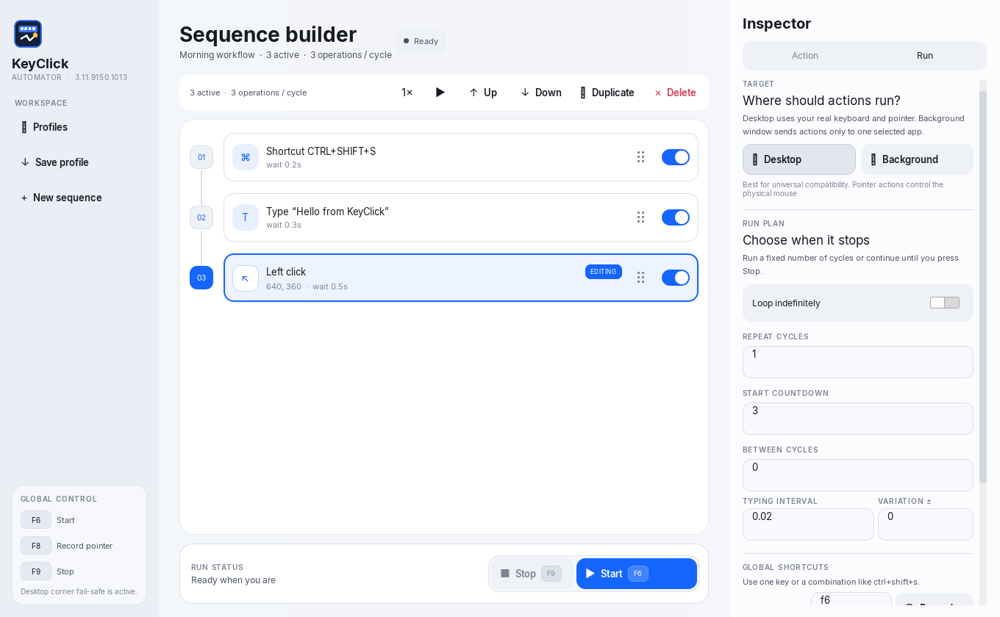

<p align="center">
  
</p>

<h1 align="center">KeyClick Automator</h1>

<p align="center">
  <a href="https://github.com/WrenzLaylo/KeyClickAutomator/actions/workflows/windows-ci.yml"></a>
  <a href="https://github.com/WrenzLaylo/KeyClickAutomator/releases/latest"></a>
  <a href="LICENSE"></a>
</p>

<p align="center">
  Build keyboard and mouse automation as a clear, visual sequence.<br>
  Made for Windows with Python, PySide6, and Qt Quick.
</p>

<p align="center">
  <a href="#quick-start">Quick start</a> ·
  <a href="#profiles">Profiles</a> ·
  <a href="#controls-and-safety">Controls</a> ·
  <a href="#run-from-source">Run from source</a> ·
  <a href="#build-a-release">Build a release</a>
</p>

> Current release: **3.4.1** · Windows 10/11 · 64-bit

<p align="center">
  
</p>

## Why KeyClick

KeyClick turns repetitive input into an ordered workflow you can inspect before
running. Add steps, adjust timing, temporarily switch steps off, save the result,
and stop the automation immediately whenever you need to.

- Keyboard presses, shortcuts, and typed text
- Left, right, double, and middle mouse clicks
- Click at a saved position or wherever the pointer is currently moving
- Send actions to one background window while your physical mouse stays free
- Choose Desktop or an open app from a visual window picker
- Record precise points on a frozen, dimmed copy of the screen
- Keep window-relative pointer positions aligned when the target is resized
- Scrolling and pointer dragging
- Per-action repeats and delays
- Finite runs or continuous looping
- Saveable `.kca.json` profiles
- Responsive desktop layout with a slide-over inspector
- Global shortcuts and a corner fail-safe

## Choose a build

| Build | Best for | What you need |
| --- | --- | --- |
| `KeyClickAutomator-Portable-3.4.1.exe` | Carrying the app on a USB drive or running it without installation | Just the one `.exe`; Python and Qt are already bundled |
| `KeyClickAutomator-Setup-3.4.1.exe` | A normal Windows installation with shortcuts and uninstall support | Run the installer once; it installs everything the app needs |

Both builds are created in the `release` folder. The portable build is one
standalone file. The setup download is smaller because it installs the bundled
runtime as a normal application folder.

> The builds are currently unsigned, so Windows SmartScreen may show a warning.
> Only run a file you built yourself or downloaded from a release you trust.

Each GitHub release includes `SHA256SUMS.txt`. Use it to verify that a downloaded
portable app or installer exactly matches the file published with that release.

## Quick start

1. Open KeyClick Automator.
2. Select **Profiles** or press `Ctrl+O` to switch to a saved sequence without
   leaving KeyClick. To start fresh, select **Create first action** or **New action**.
3. In the **Run** inspector, keep **Desktop** for normal automation or choose
   **Background window**. The visual picker shows Desktop and the open apps on
   your computer; select the exact window you want to automate.
4. Choose an action type and enter its details.
5. For a fixed mouse target, select **Pick pointer position**. KeyClick hides,
   freezes, and dims the current desktop; click the exact point without rushing,
   or press `Esc` to cancel. For clicks that should follow your hand, enable
   **Follow current pointer** instead in Desktop mode.
6. Select **Add to sequence**, then add more actions in the order they should run.
7. Drag a card by its six-dot grip to reorder it; the numbered timeline stays in
   place while only the card follows the pointer. You can also use **Up** or
   **Down**. Select any card to edit, test, duplicate, or disable it.
8. Select **Start**. Any visible Run changes are validated and applied first.
9. Press `F9` at any time for an emergency stop.

Example sequence:

| Step | Action | Timing |
| ---: | --- | --- |
| 01 | Press `ENTER` | Wait 0.1 seconds |
| 02 | Type `Hello` | Wait 0.2 seconds |
| 03 | Left click at the saved pointer position | Wait 0.5 seconds |

Disabled steps stay in the sequence but are skipped during a run. Their toggle
and content animate smoothly, and the toggle always remains available so the
step can be turned back on.

## Supported actions

| Category | Actions |
| --- | --- |
| Keyboard | Key press, multi-key shortcut, type text |
| Pointer | Left click, right click, double click, middle click |
| Movement | Scroll, drag pointer |

Every action can be edited, enabled or disabled, repeated, delayed, reordered by
dragging its grip or using **Up**/**Down**, duplicated, and deleted.

### Click while moving the pointer

For **Left click**, **Right click**, **Double click**, or **Middle click**, enable
**Follow current pointer**. KeyClick then clicks wherever the pointer is at that
moment and does not move it to saved coordinates, so you can keep moving the
mouse while repeated clicks run. Leave the option off when every click must land
at one fixed screen position.

Scroll and drag actions continue to use recorded positions because those actions
need a defined target or path.

### Automate one window in the background

In the **Run** inspector, choose **Background window**. A visual picker lists the
Desktop and usable open windows, including browser meetings, Discord, Zoom, and
other apps. Select a preview to make that exact window the target. Use **Refresh**
after opening or restoring another app.

Record mouse positions again in this mode so they are saved relative to that
window instead of the desktop. KeyClick also records the window's content size.
When the target is resized later, each click, scroll point, and drag endpoint is
scaled to the new size before the action is delivered.

While the sequence runs, KeyClick sends keyboard and mouse messages only to the
selected window. It can stay behind other windows and your physical pointer does
not move, so you can keep using the mouse elsewhere. Keep the target open,
restored, and at the same privilege level as KeyClick.

Background delivery works best with standard Windows controls. KeyClick paces
every message, checks that the target is still responsive, splits large text
inserts, and sends wheel actions as individual notches so a fast sequence cannot
flood the target's Windows message queue. Some games, raw-input applications,
elevated programs, and modern or custom-rendered controls may still ignore or
reject message-based input. Use **Test once** before a repeating run. If the
target becomes unstable or closes, do not retry it in background mode; switch to
**Desktop** mode instead. KeyClick blocks desktop-relative actions from running
in window mode (and vice versa) until their positions are recorded again.

## Controls and safety

| Default key | Action |
| --- | --- |
| `F6` | Start or toggle the current run |
| `F8` | Open the frozen-screen pointer picker |
| `F9` | Stop immediately |

The shortcuts can be recorded and changed in the **Run** inspector. On laptops,
you may need to hold `Fn` to send an F-key. In Desktop mode, KeyClick also keeps
PyAutoGUI's corner fail-safe active: moving the pointer into a screen corner can
stop automation. Background window mode leaves the physical pointer untouched;
use `F9` to stop it.

Use **Test once** to try the selected step after a three-second safety countdown,
or **Run from here** to start at the selected step. The active sequence card is
highlighted while automation runs. Before a long or repeating run, make sure
`F9` works with your keyboard.

## Profiles

- **Profiles** (`Ctrl+O`) opens an in-app library of `.kca.json` profiles in the
  current profile folder. Select any row to switch sequences immediately.
- The portable build starts with the folder beside its `.exe`, so profiles saved
  beside KeyClick appear automatically. **Change** can point the library elsewhere.
- Each row shows its action count and modified time; the loaded profile is marked
  **Current**, and unreadable KeyClick files are clearly unavailable.
- Unsaved edits still trigger **Save**, **Discard**, or **Cancel** before switching.
- `Ctrl+S` saves directly to the active profile. Use `Ctrl+Shift+S` or **Save as…**
  to create another profile, which also becomes the library's current folder.
- **Open file…** can load a profile from another folder; the library then follows
  that folder and lists its other profiles.
- The selected target mode, window identity, coordinate type, and responsive
  window-size references are saved too.
- Unsaved edits are protected by a confirmation dialog and an automatic recovery
  copy if the app or computer closes unexpectedly.
- A deleted action can be restored with **Undo** or `Ctrl+Z`.
- Profiles created by earlier 3.x releases remain compatible.

## What's new in 3.4.1

- Background messages are rate-limited and the target is checked for responsiveness
  throughout a run, preventing zero-delay sequences from flooding its message queue
- Scroll actions now deliver one standard wheel notch at a time, and extreme scroll
  values are rejected before a run starts
- Large native text inserts are split into bounded chunks, and control-specific
  commands are sent only to genuine standard Windows button and edit controls

### Previous release: 3.4.0

- A visual target picker shows Desktop and open app windows with previews, names,
  selected state, refresh, and clear handling for minimized windows
- Pointer recording now hides KeyClick and opens a frozen, dimmed desktop overlay;
  click once to choose the exact point, or press `Esc` to cancel
- Background-window mouse positions store their reference content size and scale
  clicks, scrolling, and both drag endpoints whenever the target is resized
- Drag-to-reorder now moves only the action card while the numbered timeline and
  connector remain anchored in place
- The unsaved-changes dialog now uses contained, balanced Cancel, Discard, and
  Save actions that stay inside the modal at the minimum window size

### Earlier release: 3.3.0

- The in-app **Profiles** drawer lists saved sequences beside the portable app
- Profiles open with one click while unsaved edits remain protected
- Current-profile highlighting, action counts, modified times, invalid-file states,
  folder switching, and direct `Ctrl+S` saves make profiles easier to manage

## Release history

| Version | Summary |
| --- | --- |
| 3.4.1 | Safer paced background delivery with responsiveness and queue-flood protection |
| 3.4.0 | Visual window picker, frozen point capture, and resize-aware window positions |
| 3.3.0 | In-app profile library with safe one-click switching and folder discovery |
| 3.2.1 | Drag-to-reorder sequence cards and corrected recovery-dialog actions |
| 3.2.0 | Background-window targeting with window-relative mouse actions and a free physical pointer |
| 3.1.0 | Moving-pointer clicks, delayed position recording, safer testing, undo, and draft recovery |
| 3.0.8 | Workflow-card redesign, compact controls, packaging reduction, and animated action toggles |
| 3.0.7 | Neutral navigation hover treatment |
| 3.0.6 | Safe recording for all global shortcuts |
| 3.0.2 | Runtime-driven version labels |
| 3.0.1 | Repaired interaction states and sequence visibility |
| 3.0.0 | Complete Qt Quick interface rebuild |
| 2.1.0 | Previous modern desktop release |

The release process is documented in [RELEASING.md](RELEASING.md). Its checklist
requires every version bump to update this README, and the automated tests verify
that the current version, artifact names, and release notes stay in sync.

## Run from source

Requirements: Windows and Python 3. Git is only needed if you clone the repository.

```powershell
py -3 -m venv .venv
.venv\Scripts\python.exe -m pip install -r requirements.txt
.venv\Scripts\python.exe qt_app.py
```

No installation step is needed after the dependencies finish installing.

## Run the tests

```powershell
.venv\Scripts\python.exe -m pip install -r requirements-dev.txt
.venv\Scripts\python.exe -m pytest -q
```

The suite covers the automation engine, cancellation and timing, profile files,
controller behavior, frozen pointer recording, visual window discovery,
resize-aware background coordinates, background-window delivery and follow mode,
draft recovery, card-only drag reordering, modal containment, responsive breakpoints,
QML loading, interaction states, and release-version consistency.

## Build a release

Build the single-file portable app:

```powershell
.venv\Scripts\python.exe -m PyInstaller --clean --noconfirm KeyClickAutomator.spec
New-Item -ItemType Directory -Force release | Out-Null
Copy-Item dist\KeyClickAutomator.exe release\KeyClickAutomator-Portable-3.4.1.exe
```

Build the installer payload, then compile it with Inno Setup 6:

```powershell
.venv\Scripts\python.exe -m PyInstaller --clean --noconfirm KeyClickAutomatorInstaller.spec
& "$env:LOCALAPPDATA\Programs\Inno Setup 6\ISCC.exe" "installer.iss"
```

Close any running release copy before rebuilding, and adjust the `ISCC.exe` path
if Inno Setup was installed somewhere else.

The Windows workflow runs the full test suite on every pull request and `main`
push. Version tags and manual runs also build both packages and produce a
`SHA256SUMS.txt` artifact.

Before publishing, complete every check in [RELEASING.md](RELEASING.md).

## Project layout

| Path | Purpose |
| --- | --- |
| `qml/Main.qml` | Desktop screens, layout, and interaction flow |
| `qml/components/` | Shared button, field, and scrollbar styling |
| `qt_controller.py` | UI model and run coordination |
| `profile_catalog.py` | Saved-profile discovery and display metadata |
| `recovery_store.py` | Atomic recovery-draft persistence |
| `shortcut_service.py` | Shortcut conflicts and global-listener formatting |
| `engine.py` | Automation actions, validation, timing, and execution |
| `window_backend.py` | Windows target discovery and background message delivery |
| `capture_overlay.py` | Frozen, dimmed multi-monitor pointer picker |
| `tests/` | Controller, engine, QML, responsive, and release tests |
| `.github/workflows/windows-ci.yml` | Windows tests, packaging, and checksums |
| `KeyClickAutomator.spec` | Single-file portable build |
| `KeyClickAutomatorInstaller.spec` | Multi-file installer payload |
| `installer.iss` | Inno Setup configuration |

## License

KeyClick Automator is available under the [MIT License](LICENSE).

## Font license

Inter is distributed under the SIL Open Font License 1.1. The full license is
included at `assets/fonts/LICENSE.txt` and packaged with the application.
